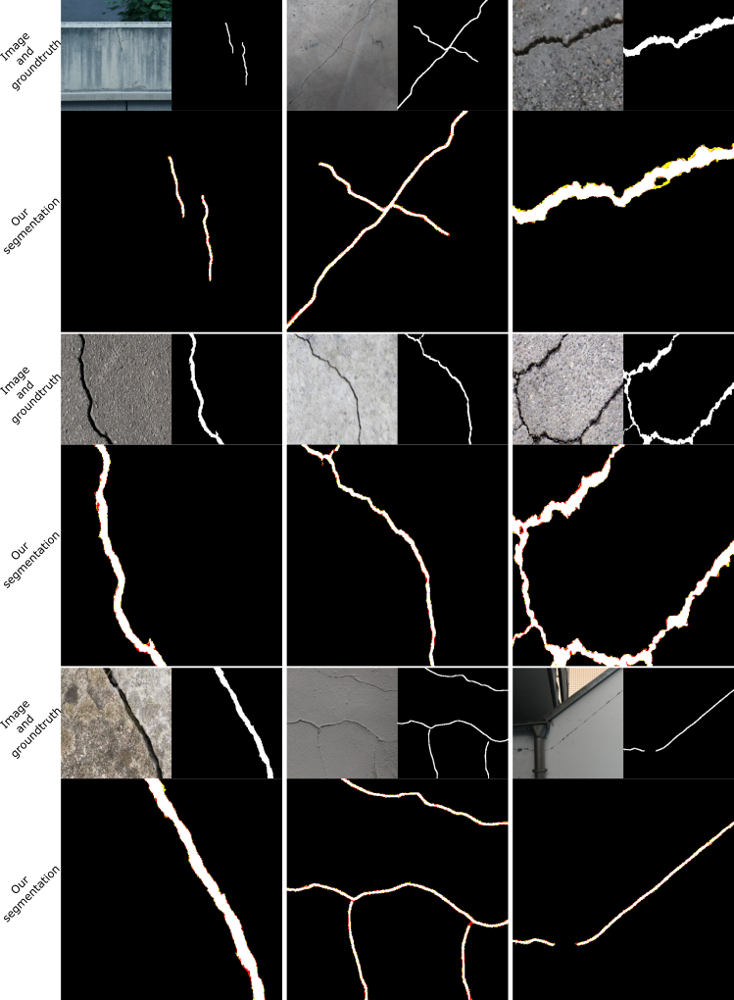

# SegDecNet++ for concrete crack segmentation 
Official PyTorch implementation for ["Automated detection and segmentation of cracks in concrete surfaces using joined segmentation and classification deep neural network"](http://prints.vicos.si/publications/430) published in journal Construction and Building Materials 2023.


[![CC BY-NC-SA 4.0][cc-by-nc-sa-shield]][cc-by-nc-sa] 

Code is licensed under [Creative Commons Attribution-NonCommercial-ShareAlike 4.0 International License][cc-by-nc-sa]. For comerical use please contact danijel.skocaj@fri.uni-lj.si.

[![CC BY-NC-SA 4.0][cc-by-nc-sa-image]][cc-by-nc-sa]

[cc-by-nc-sa]: http://creativecommons.org/licenses/by-nc-sa/4.0/
[cc-by-nc-sa-image]: https://licensebuttons.net/l/by-nc-sa/4.0/88x31.png
[cc-by-nc-sa-shield]: https://img.shields.io/badge/License-CC%20BY--NC--SA%204.0-lightgrey.svg


## Citation
Please cite our [Construction and Building Materials 2023 paper](http://prints.vicos.si/publications/340) when using this code:

```
@article{Tabernik2023CONBUILDMAT,
  author = {Tabernik, Domen and {\v{S}}uc, Matic and 
  Sko{\v{c}}aj, Danijel},
  journal = {Construction and Building Materials},
  title = {{Automated detection and segmentation of cracks in concrete surfaces using joined segmentation and classification deep neural network}},
  year = {2023]}
}
```

## How to run:

### Requirements
Code has been tested to work on:
+ Python 3.8
+ PyTorch 1.8
+ CUDA 11.1
+ using additional packages as listed in requirements.txt

Deploy enviroment using conda:

```bash
conda create env --name SegDecNet++ --file=environment.yml 
```

### Datasets
We use dataset from [SCCDNet paper](https://www.mdpi.com/2076-3417/11/11/5074), which consists of the following image sets:
* CFD
* CRACK500
* CrackTree200
* DeepCrack
* GAPs384
* Rissbilder
* non-crack images

However, since the dataset contains major issues for Rissbilder groundtruth, we provide a corrected groundtruth for the whole SCCDNet dataset 
 * [DOWNLOAD corrected SCCDNet dataset here.](https://go.vicos.si/sccdnetdbcorrected)

### Replicating paper results

To replicate the results published in the paper run:
```bash
./EXPERIMENTS_CONBUILDMAT.sh
```

Results will be written to `./RESULTS` folders.

### Usage of training/evaluation code
The following python files are used to train/evaluate the model:
+ `train_net.py` Main entry for training and evaluation
+ `models.py` Model file for network
+ `data/dataset_catalog.py` Contains currently supported datasets

### Examples



Examples of crack segmentation with our proposed method. We depict false positive pixels in red, and false negatives in yellow, while the correct
background segmentation is in black and the correct foreground in white.